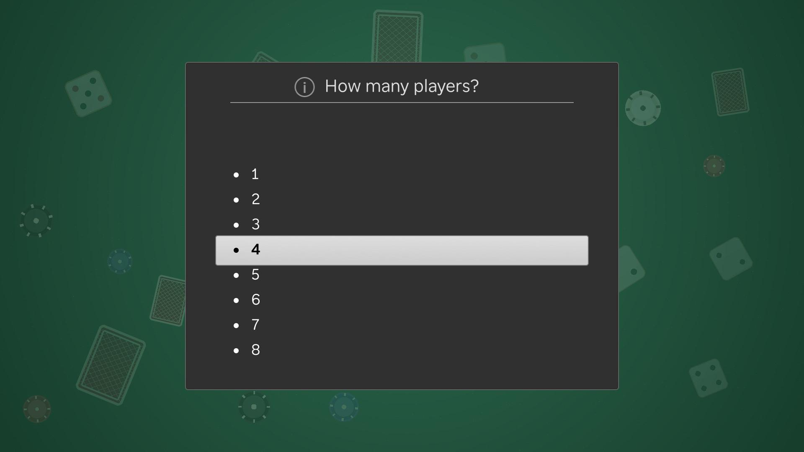
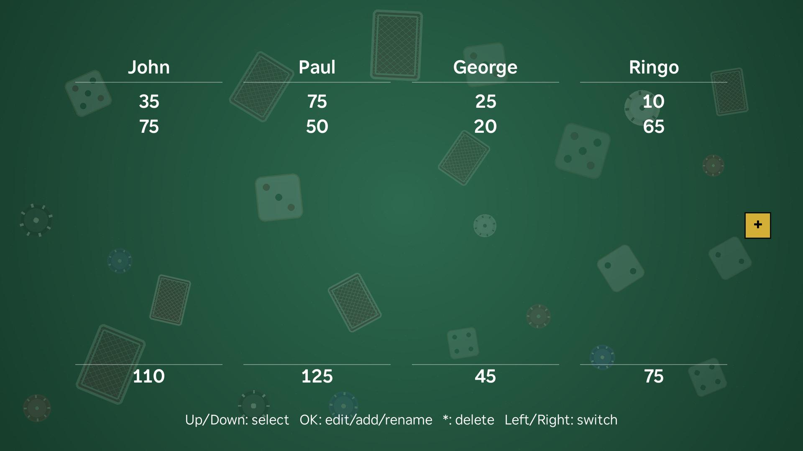
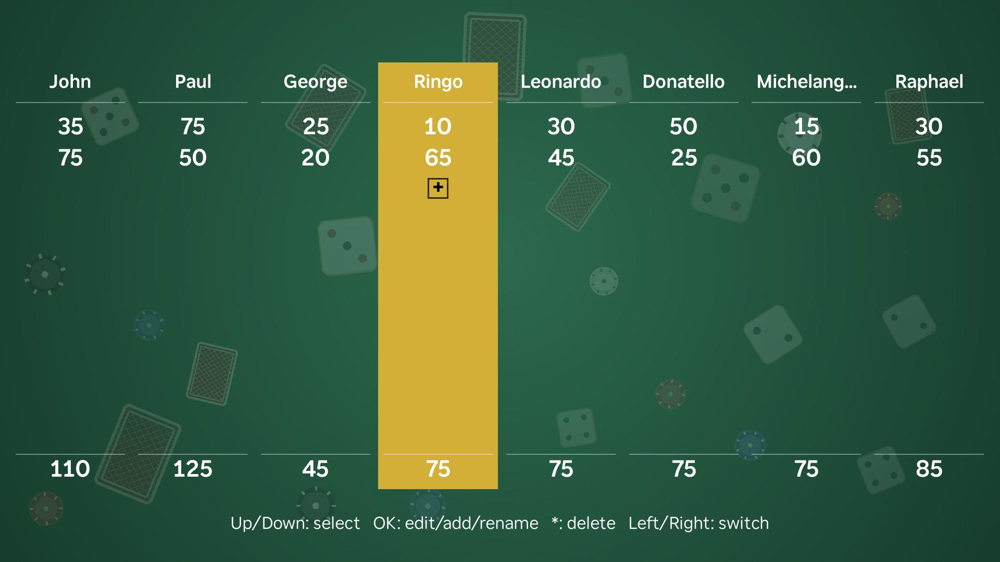

# Scorekeeper

A remote-driven scorekeeping channel for Roku. Built for card games and
tabletop games — track scores for 1 to 8 players across as many rounds as
you need, right on your TV.

## Screenshots

## Features

- **1–8 players** — choose at launch, add or remove players mid-game
- **Per-round score history** — every round is logged; scroll back and edit any entry
- **Two-column layout** — automatically kicks in at 10+ rounds so everything stays on screen
- **Up to 36 rounds** — row height compresses gracefully as rounds accumulate
- **Direct score editing** — navigate to any round and adjust with Up/Down (hold for ×10 acceleration)
- **Rename players** — set custom names any time during the game
- **All remote, no typing** — fully controlled with the standard Roku d-pad

## Installation

### Requirements

- A Roku device
- The device and your computer (or mobile phone) on the same network

### Sideload

1. Turn your Roku device into Developer mode.
    <ol type="a">
        <li>From the home screen, hit the following on your Roku Remote: Home-Home-Home-Up-Up-Right-Left-Right-Left-Right.  That is, Home*3, Up*2, then Right-Left-Right-Left-Right.</li>
        <li>Now that you're in the Developer Settings, make note of the IP address you are given (you'll need it later).  Select Enable Installer and Restart.  It will have you set a password (remember that too).</li>
    </ol>
2. Download app.zip, either from this repo or from [here](https://benjs-bucket.s3.us-west-1.amazonaws.com/app.zip)
3. Open `http://<the-ip-address-you-were-given>` in a browser on the same device.  You may need to give permission for your browser to access nearby devices.
4. Log in using username: `rokudev` and the password you set in Step 1b.
5. Upload `app.zip` via the **Replace with Zip** button.

And voila!  Your Roku device should load the app automatically.  Have fun gaming!

Note: Since this is a Sideload installation, you can only have one Dev application installed at a time.  Also, if you update your Roku software, it may be taken out of Developer Mode and you may need to reinstall.

## Legal

- [Privacy Policy](PRIVACY_POLICY.md)
- [Terms of Use](TERMS_OF_USE.md)

Scorekeeper collects no data of any kind.

## License

© 2026 Benjamin Zagorski. All rights reserved.
